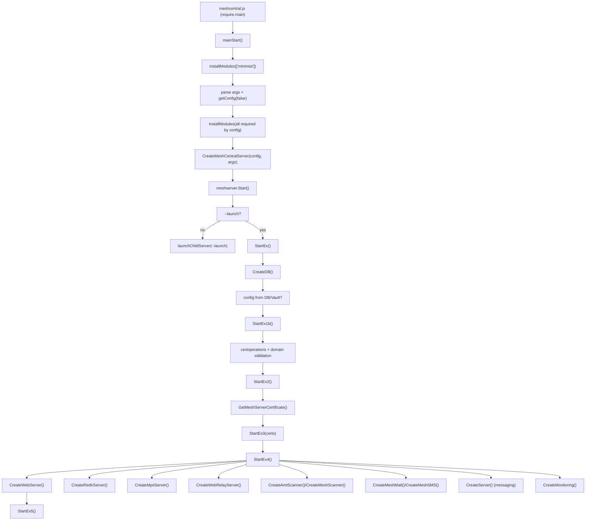

Here’s the Node.js startup sequence for MeshCentral as implemented in the repo, with the key flow and file locations.

**Entry Point**
1. `mainStart()` is invoked when `meshcentral.js` is run directly (`require.main === module`).  
   File: `/Users/alariv/github/MeshCentral/meshcentral.js`

**High-Level Startup Flow**
1. **Node version check** and working directory normalization.  
   File: `/Users/alariv/github/MeshCentral/meshcentral.js`
2. **Minimal dependency bootstrap**: installs `minimist` if missing, then parses CLI args.  
   File: `/Users/alariv/github/MeshCentral/meshcentral.js`
3. **Load config** via `getConfig(false)` from `meshcentral-data/config.json` (or `--configfile`).  
   File: `/Users/alariv/github/MeshCentral/meshcentral.js`
4. **Determine optional features** (RDP, LDAP, SMTP, OIDC, etc.) and build a **module list** based on config.  
   File: `/Users/alariv/github/MeshCentral/meshcentral.js`
5. **Install missing modules** then construct server object and start it.  
   - `meshserver = CreateMeshCentralServer(config, args)`  
   - `meshserver.Start()`  
   File: `/Users/alariv/github/MeshCentral/meshcentral.js`

**CreateMeshCentralServer() → Start()**
1. Initializes server object, paths, defaults, and Windows service helpers.  
   File: `/Users/alariv/github/MeshCentral/meshcentral.js`
2. `Start()` validates CLI args, handles one-off commands, and decides how to run:  
   - If `--launch` is present → **run in-process**.  
   - Else → **spawn child process** with `--launch` and monitor it (self-restart/update logic).  
   File: `/Users/alariv/github/MeshCentral/meshcentral.js`

**Startup Pipeline After `--launch`**
1. `StartEx()`  
   - Syslog setup, IP lists, config warnings.  
   - Create DB via `CreateDB()`.  
   - If `--loadconfigfromdb` or Vault is enabled, reload config.  
   File: `/Users/alariv/github/MeshCentral/meshcentral.js`  
   File: `/Users/alariv/github/MeshCentral/db.js`
2. `StartEx1b()`  
   - Certificate operations setup.  
   - Domain validation and normalization.  
   - Initialize task manager, plugins, mesh core, and mesh cmd.  
   - Start redirect server if needed.  
   File: `/Users/alariv/github/MeshCentral/meshcentral.js`
3. `StartEx2()`  
   - Load server certs; configure Let’s Encrypt if enabled.  
   File: `/Users/alariv/github/MeshCentral/meshcentral.js`  
   File: `/Users/alariv/github/MeshCentral/certoperations.js`  
   File: `/Users/alariv/github/MeshCentral/letsencrypt.js`
4. `StartEx3(certs)`  
   - Load domain web certs, AMT ACM certs.  
   - Cloudflare trusted proxy loading (if enabled).  
   File: `/Users/alariv/github/MeshCentral/meshcentral.js`
5. `StartEx4()`  
   - Final runtime setup: agents, tools, translations, session keys.  
   - Start web server, MPS, relay, scanners, mail/SMS, messaging, web push, Firebase.  
   - Monitoring, maintenance timers, server stats.  
   File: `/Users/alariv/github/MeshCentral/meshcentral.js`  
   File: `/Users/alariv/github/MeshCentral/webserver.js`  
   File: `/Users/alariv/github/MeshCentral/mpsserver.js`  
   File: `/Users/alariv/github/MeshCentral/redirserver.js`  
   File: `/Users/alariv/github/MeshCentral/webrelayserver.js`  
   File: `/Users/alariv/github/MeshCentral/meshmail.js`  
   File: `/Users/alariv/github/MeshCentral/meshsms.js`  
   File: `/Users/alariv/github/MeshCentral/meshmessaging.js`
6. `StartEx5()`  
   - Runs post-webserver tasks (IP KVM manager, optional startup script).  
   File: `/Users/alariv/github/MeshCentral/meshcentral.js`

If you want, I can draw a compact call graph (or a diagram) that shows the sequence and where each subsystem plugs in.

